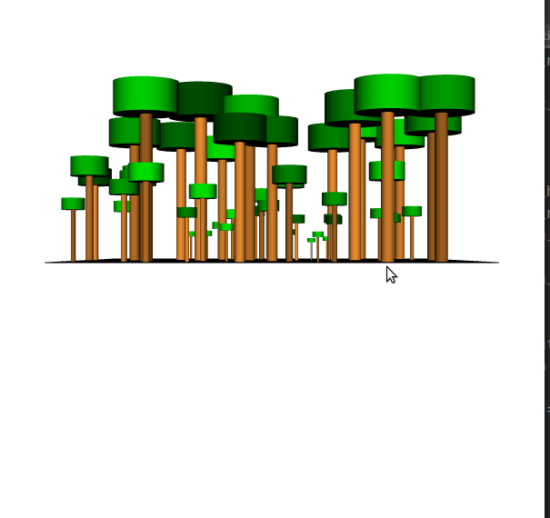

# A model visualisation of forest growth with vtk and python 

It is hard to make experiments in woodlands, because of the long lifespan of trees. Modelling the dynamics in forest can be therefore a useful choice.

This is a simple model to describe tree growth and death, the visualisation is done with the VTK library.    

MIT License
Copyright (c) 2021 Felix Nößler